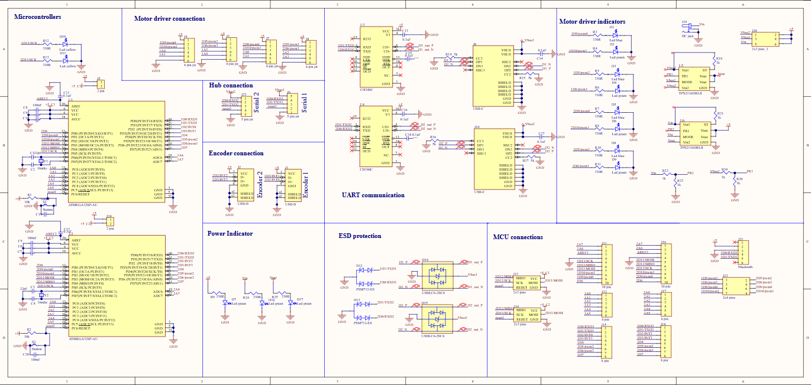
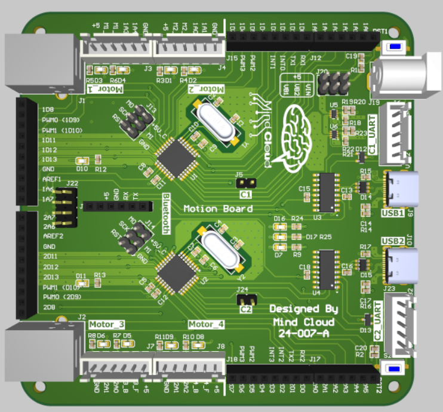

# 🛻 UGV Control Board

A custom-designed control board for an **Unmanned Ground Vehicle (UGV)**, created in Altium Designer. It features two STM32 microcontrollers, robust I/O protection, flexible communication options (USB, UART, Bluetooth), and smart power input selection via an automatic switchover circuit.

---

## 🚀 Overview

This board acts as the central brain of a UGV, handling sensor input, encoder feedback, Bluetooth or wired communication with a host, and coordination between subsystems.

Key interfaces include:
- USB-C (via CH340) for UART comms + power
- UART header for optional debug/programming
- Bluetooth UART header for wireless control
- USB-B for encoder input
- DC jack for primary power
- Automatic switchover logic between USB-C and DC jack

---

## 📌 Key Features

- **🧠 Microcontrollers**
  - Two STM32 MCUs for distributed processing

- **🔌 Communication Interfaces**
  - USB-C to UART (via CH340) for PC connection and power
  - UART header for easier integration with system
  - **Pin header for Bluetooth UART module** (e.g., HC-05/06, JDY-31)
  - USB-B port dedicated to encoders

- **⚡ Power Input**
  - 5V DC jack as the main source
  - UART from the main system hub
  - USB-C as an alternative source (or for development)
  - Switchover circuit ensures safe and prioritized power selection

- **🛡️ Protection & Reliability**
  - ESD protection on all critical I/O lines
  - Debug and status LEDs for each subsystem
  - Decoupling capacitors for all major ICs

- **📡 Expandability**
  - Bluetooth header for wireless control
  - Headers for I²C, SPI, UART, GPIO
  - Modular access to peripheral subsystems

---

## 🖼️ Visuals

### 🔧 Schematic Overview  

### 🧱 3D Board Render  

---

## 📦 BOM Summary (Top Components)

| Name         | Description                          | Designators         | Qty |
|--------------|--------------------------------------|---------------------|-----|
| STM32 MCU    | ARM Cortex-M STM32 Microcontrollers  | U1, U2              | 2   |
| CH340        | USB to UART Bridge                   | U3                  | 1   |
| USB-B Port   | Encoder input interface              | J1                  | 1   |
| USB-C Port   | UART + power input                   | J2                  | 1   |
| DC Jack      | Primary 5V input                     | J3                  | 1   |
| Bluetooth Header | UART-based wireless module       | J4 (or similar)     | 1   |
| ESD Diodes   | Line protection                      | Various             | –   |
| LEDs         | Status/Debug indicators              | D1–D9, D16, D17     | 11  |

---

## ⚙️ Setup & Usage

1. **Powering the Board:**
   - Plug into DC jack (recommended)
   - Or use USB-C for both power and UART
   - Switchover circuit selects the best available source

2. **Communication:**
   - **USB-C (CH340)** for UART comms with PC
   - **UART header** for debugging or flashing firmware
   - **Bluetooth UART header** for wireless control (e.g., HC-05)

3. **Encoder Input:**
   - Connect via USB-B port

4. **Programming:**
   - Use SWD or UART bootloader for both STM32 MCUs

---

## 🧠 Design Notes

- Dual-MCU architecture enhances modularity and responsiveness
- Switchover circuit prevents power conflict between USB and DC sources
- Dedicated Bluetooth UART port allows wireless control or telemetry
- ESD and decoupling components improve safety and stability in field environments

---

## 📄 Documentation

- [CH340 Datasheet](http://www.wch-ic.com/products/CH340.html)
- [STM32 MCUs](https://www.st.com/en/microcontrollers-microprocessors/stm32-32-bit-arm-cortex-mcus.html)
- [Bluetooth Modules](https://www.electronicwings.com/nodemcu/hc-05-bluetooth-module-interfacing-with-nodemcu)

---

## 🧾 License

This project is licensed under the **MIT License**. See `LICENSE` for more details.
